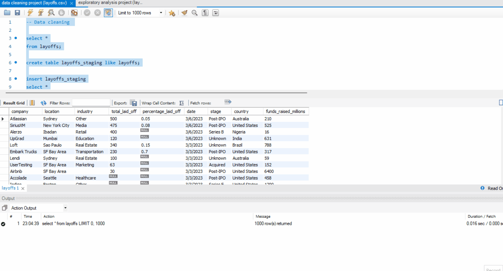

# Data Cleaning and Exploration with SQL
This SQL script performs data cleaning and exploratory data analysis on a `layoffs` table to prepare it for further insights. The process includes the following steps:

## Data Sources
* Layoffs Dataset: layoffs.csv

## How to Use
1.  **Download** the `layoffs.csv` file.
2.  **Import** the CSV file into a MySQL database.
3.  Execute the following SQL script.

## 1. Data Cleaning

* A staging table (`layoffs_staging2`) is created as a copy of the original `layoffs` table.
* The script identifies and removes duplicate rows.
* Leading and trailing whitespaces are removed from text columns.
* Inconsistencies in the `industry` and `country` columns are addressed.
* The `date` column is converted to a proper DATE format.
* Null and blank values in key columns are handled.
* Redundant columns are dropped.
* The final cleaned dataset is stored in `layoffs_staging2`.

## 2. Exploratory Data Analysis (EDA)

The script also includes exploratory data analysis to provide insights into the cleaned data.  Key areas of investigation include:

* Identifying companies and industries with the highest layoff numbers.
* Analyzing layoffs as a percentage of company size.
* Examining the relationship between funds raised and layoffs.
* Calculating monthly layoff trends.
* Determining the top 5 companies with the most layoffs per year.

## Preview

